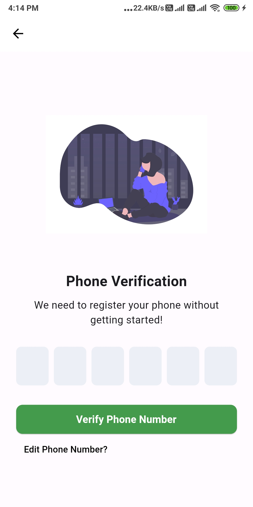

# Phone Number Authentication

# Important Steps 
## SHA certificate fingerprints

 android/gradlew location to select gradlew file and open the terminal to write a code.
  ./gradlew singingReport

 android/app/build.gradle to paste a code.
  implementation("com.google.firebase:firebase-auth")

## ScreenShots

|  |  |  |